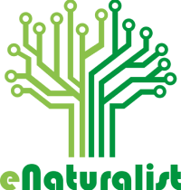

<p align="center">
  
<p>

<p align="center"> 
  
  
  <a href="https://github.com/rafaelfachinelli">
    
  </a>
  
<p>

<p align="center">
 <a href="#computer-sobre">Sobre</a> •
 <a href="#memo-roteiro">Roteiro</a> •
 <a href="#triangular_ruler-status-do-projeto">Status</a> •
 <a href="#movie_camera-demonstração">Demonstração</a> •
 <a href="#dvd-executar-o-projeto">Executar</a> •
 <a href="#hammer-tecnologias">Tecnologias</a> •
 <a href="#pray-equipe">Equipe</a> •
 <a href="#page_facing_up-licença">Licença</a>
</p>

---
## :computer: Sobre

A plataforma da eNaturalist fornece informações de conscientização sobre as consequências do descarte incorreto do lixo eletrônico e realiza o mapeamento de ecopontos nas cidades da região do Alto Tietê para coleta de eletrônicos.

Também possui a possibilidade para cadastrado de aparelhos eletrônicos para doação. Na plataforma as instituições públicas autorizadas podem conultar e entrare em contato com o doador para busca ou recebimento do aparelho eletrônico.

---
## :memo: **Roteiro**

<div align="center">

|      Estado      |     Plataforma   |     Tarefa    |
|      :---:       |       :---:      |      :---     |
|:heavy_check_mark:|:computer:        |Definição de responsabilidades|
|:heavy_check_mark:|:computer:        |Organização de reuniões|
|:heavy_check_mark:|:computer:        |Planejamento da estrutura geral|
|:heavy_check_mark:|:iphone:          |Design das telas do aplicativo|

</div>

---
## :triangular_ruler: **Status do Projeto**

<h4 align="center"> 
	👨‍🏫 eNaturalist em planejamento !
</h4>

---
## :movie_camera: **Demonstração**

<p align="center"><b> :computer::iphone: WEB RESPONSIVO </b></p>


<p align="center"><b> :iphone: APLICATIVO </b></p>

<div align="center">


</div>

---
## :dvd: **Executar o Projeto**

### :desktop_computer: **WEB Responsivo**

Entre na pasta [`web/`](web/) e execute os seguintes comandos:

_com **npm**_

```bash
# 
$ 
```

_com **yarn**_

```bash
# 
$ 
```

> ⚠️ 

### :globe_with_meridians: **Servidor**

Entre na pasta [`server/`](server/) e execute os seguintes comandos:

_com **npm**_

```bash
# 
$ 
```

_com **yarn**_

```bash
# 
$ 
```

### :iphone: **Aplicativo**

Entre na pasta [`mobile/`](mobile/) e execute os seguintes comandos:

_com **npm**_

```bash
# 
$ 
```

_com **yarn**_

```bash
# 
$ 
```

---

## :hammer: **Tecnologias**

As seguintes ferramentas foram utilizadas na construção do projeto:

<div align="center">

|WEB Responsivo								|Servidor					|Aplicativo|
|:---:									|:---:						|:---:|
|[HTML5](https://developer.mozilla.org/pt-BR/docs/Web/HTML/HTML5)	|[Node.JS](https://nodejs.org/pt-br/)		||
|[CSS3](https://developer.mozilla.org/pt-BR/docs/Archive/CSS3)		|||

</div>

---
## :pray: **Equipe**

Feito com 💚 pela eNaturalist 👋🏽 Entre em contato!

[](mailto:enaturalist.fatec@gmail.com)

---
## :page_facing_up: **Licença**

Copyright © 2020 [eNaturalist](https://github.com/rafaelfachinelli).<br />
Este projeto é licenciado pelo [MIT](./LICENSE).
